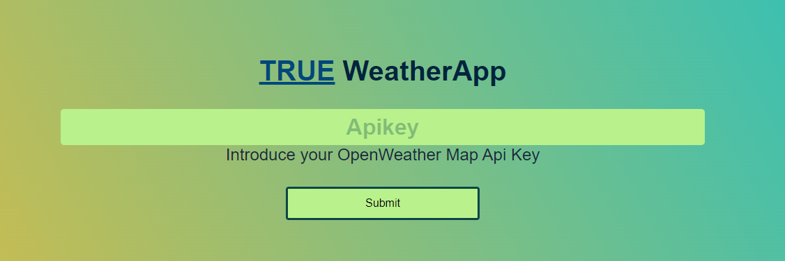
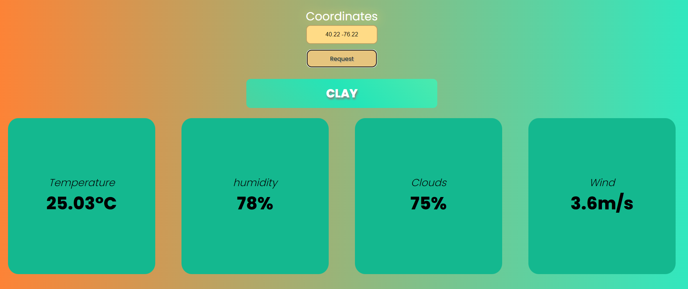

# TrueWeatherApp
An upgradeded version of the Weather App. Practice working with API's and FrontEnd with HTML/CSS.

# Download the project

You can easily clone this respository to your local machine just by going to your target directory and paste:

    https://github.com/SrSujeto55/TrueWeatherApp.git

# Prerequisites
This aplicaton runs with Node **16.17.0** on Windows and Linux.
It's completely escencial to download this version of node or superior.

## Windows instalation
You can go to the oficial NodeJs page and download the lates version, follow the wizzard instalation steps.

    https://nodejs.org/es/download/

## Linux/Fedora
First, update your system repositories if you haven't.

    sudo dnf update -y

afterwards, we can install Node with the following command:

    sudo dnf install -y nodejs

# Start the project

To start the project you have to locate yourself at your instalation directory and type:

    npm install

this will install al the dependecies and packages the app needs.

Here is a list of all the dependecies used for this project:

- body-parser  V1.20.2
- ejs V3.1.9
- express V4.18.1
- jsdoc V4.0.2
- multer V1.4.5-lts.1 
- node-fetch V2.6.7
- nodemon V2.0.22

# Excecute project
 
 To start using this project you have to type in your terminal the following code: 

    npm run start

afterwards, the program will start and open a port directly in the direction 3000.

This means that you can open your desire browser and go to:

    http://localhost:3000 

to start using this program.

# About ApiKey
This aplication uses an apikey from the OpenWeatherMap page, this let us send request to their api and send back data, for this reason is completely important to have an apiKey avaliable for your personal use.

If you don't have an OpenWeatherMap ApiKey, you can get yours here

    https://openweathermap.org/api

just subscribe with the free plan and that's it, you get your 32 characters long apikey.
# About the weather

Afer you introduce your apiKey, you get to an interface where you can consult the weather with coordinates, it's important to follow the example in the input field placeholder, that's the right way to request weather otherwise the program will reject your coordinates

# End program

To close the server and free up your terminal, you can go to your terminal and just press 

    Ctrl + C

to stop the excecution.

# Generate Docs
To generate the documentation for this project you just have to type

    npm run docs

and automatically will start generating the docs directory inside the root directory of this project, simply go to the docs directoy and open the index.html.

